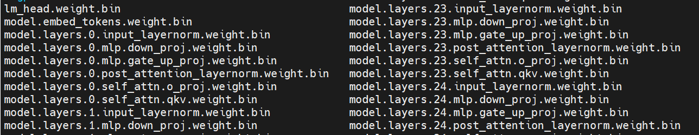

**# steps to download HF llama weights and convert to bin file**

1. download weight from https://huggingface.co/meta-llama/Llama-2-7b-chat-hf/tree/main or https://huggingface.co/meta-llama/Llama-2-7b/tree/main note that maybe apply for access first

**!!!NOTE: if you download weight from https://huggingface.co/meta-llama/Llama-2-7b/tree/main, then you must do step 2, or skip 2 and do step 3**

2. run `python convert_downloaded_llama_weights.py --input_dir /path/to/downloaded/llama/weights --model_size 7B --output_dir /output/path` and then, we can get some output files

3. if you skip step 2, we run `python weights_convert.py -i path/to/model_dir -o path/to/final_bin_file`. And if not, based on files got by step 2, we run `python weights_convert.py -i path/to/step2's_output_dir -o path/to/final_bin_file`

then we can get the weights like below pic:

4. at this time, the weight is ready, and replace the weight path in user_entry.cpp by your step3's output path